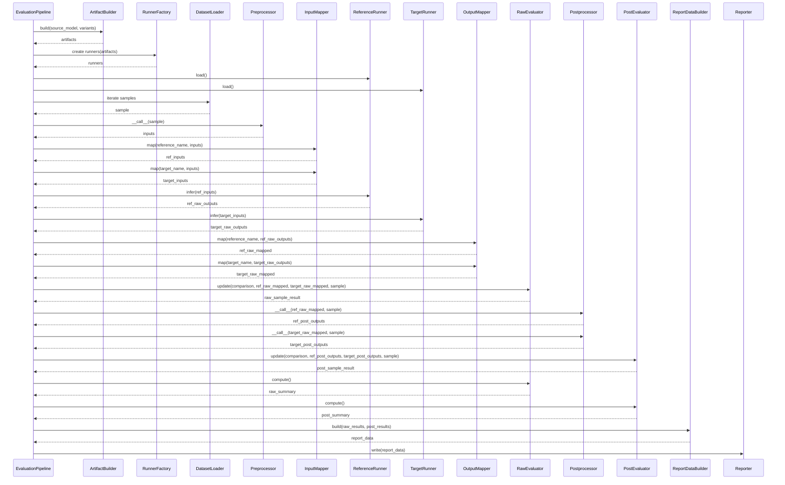

# TensorRT 精度評価ツール 設計仕様書

## 1. 目的

本ツールは、1つの ONNX モデルを複数 backend / precision で実行し、TensorRT 化や実行backend差分による精度差分を評価するための Python ツールである。

入力モデルファイルは `.onnx` を基本とする。評価初期化時に、ONNX Runtime、OpenVINO、TensorRT FP32、TensorRT FP16 などの評価backendに対応した実行artifactを変換またはビルドし、同一入力に対して推論結果を比較する。

1回の評価実行では、1つの論理モデルだけを対象とする。  
ここでいう1つの論理モデルとは、同じ意味の入力・出力・前処理・後処理を共有するモデルであり、ONNX Runtime、OpenVINO、TensorRT などの Runner はそのモデルの実行backend差分として扱う。

設計上の重要な方針は、評価コアがモデル固有の前処理・後処理・比較ロジックを知らないことである。モデル固有処理は、共通インターフェースを実装したクラスとして差し込む。

## 2. 設計方針

- 評価コアは抽象インターフェースだけに依存する。
- Runner、Preprocessor、Postprocessor、Metric は差し替え可能なコンポーネントにする。
- 各コンポーネントは自身の config を受け取り、自分で解釈する。
- 呼び出し側は具体的な config schema を知らない。
- 生のモデル出力比較と、後処理後の結果比較を分離する。
- 生出力比較は汎用的な tensor metric を中心にする。
- 後処理後の比較はモデル依存のため、Metric plugin として差し込めるようにする。
- 初期標準対応タスクは classification、detection、CNN backbone feature comparison とする。
- 上記以外のタスクは Postprocessor と Metric の追加だけで拡張できるようにする。
- 入力モデルは `.onnx` を単一の source model として扱う。
- OpenVINO IR や TensorRT engine は source model から生成される評価artifactとして扱う。
- ONNX Runtime、OpenVINO、TensorRT native、ONNX Runtime Execution Provider はすべて Runner として同列に扱う。
- ORT CPU / ORT CUDA / ORT TensorRT EP / TensorRT FP32 / TensorRT FP16 などを同一モデルの backend variant として比較する。
- 基準runnerは config で指定する。初期推奨は `ort_cpu` または `ort_cuda` とする。
- 1回の評価で複数の論理モデルを同時に扱わない。
- 複数入力・複数出力は、同一モデル内の入出力として扱う。

## 3. 評価パイプライン

```text
SourceModel(.onnx)
  -> ArtifactBuilder
  -> backend artifacts
RunnerFactory
  -> runners
DatasetLoader
  -> raw sample
Preprocessor
  -> model input TensorDict
InputMapper
  -> runner-specific input TensorDict
Runner
  -> raw output TensorDict
OutputMapper
  -> normalized raw output TensorDict
RawEvaluator
  -> raw comparison results
Postprocessor
  -> postprocessed ComparableDict
PostEvaluator
  -> post comparison results
Reporter
  -> JSON/CSV/HTML reports
```

評価コアは、画像分類・物体検出・セグメンテーションなどのタスク固有の意味を知らない。  
タスク固有の意味は Postprocessor と PostMetric が責務として持つ。

初期実装では、以下の3種類を標準評価対象とする。

- Classification model
- Detection model
- CNN backbone feature output

ただし評価コアはこの3種類にも直接依存しない。標準提供する Metric / Postprocessor として実装し、追加タスクは同じインターフェースで拡張する。

## 3.1 Backend Variant

1つの ONNX source model から、複数の backend variant を作成して比較する。

想定する初期variant:

- `ort_cpu`: ONNX Runtime CPUExecutionProvider
- `ort_cuda`: ONNX Runtime CUDAExecutionProvider
- `ort_trt`: ONNX Runtime TensorRTExecutionProvider
- `openvino_cpu`: OpenVINO CPU
- `openvino_gpu`: OpenVINO GPU
- `trt_fp32`: native TensorRT engine FP32
- `trt_fp16`: native TensorRT engine FP16

各 variant は以下の責務に分かれる。

```text
ArtifactBuilder:
  .onnx から実行に必要なartifactを準備する。

Runner:
  準備済みartifactをロードして推論する。
```

ONNX Runtime は `.onnx` を直接ロードできるため、明示的な変換artifactを持たない場合がある。  
OpenVINO は `.onnx` を直接 compile するか、必要に応じて IR / cache を生成する。  
TensorRT native は `.onnx` から FP32 / FP16 engine を build する。

生成artifactは cache 可能とする。source model、backend type、precision、build config、tool version が同じ場合は再利用できる。

## 4. データ契約

### 4.1 TensorDict

Runner 入力、および Runner の生出力に使う。

```python
TensorDict = dict[str, np.ndarray]
```

例:

```python
{
    "input": np.ndarray,
}
```

```python
{
    "logits": np.ndarray,
    "boxes": np.ndarray,
}
```

複数入力モデルの場合も、1つの `TensorDict` に複数 tensor を持たせる。

```python
{
    "image": np.ndarray,
    "aux_image": np.ndarray,
    "camera_param": np.ndarray,
}
```

このキーは評価ツール内で使う論理入力名である。Runner ごとの実入力名が異なる場合は `InputMapper` で変換する。

```text
common input names
  image, aux_image
    -> InputMapper
runner input names
  input_0, input_1
```

### 4.2 ComparableDict

Postprocessor 後の比較対象に使う。

```python
ComparableDict = dict[str, Any]
```

後処理後の結果はモデルごとに構造が異なるため、あえて柔軟な `dict[str, Any]` とする。

分類モデルの例:

```python
{
    "probs": np.ndarray,
    "top1": int,
    "top5": list[int],
}
```

物体検出モデルの例:

```python
{
    "detections": [
        {
            "box": np.ndarray,
            "score": float,
            "class_id": int,
        }
    ]
}
```

セグメンテーションモデルの例:

```python
{
    "mask": np.ndarray,
    "scores": np.ndarray,
}
```

特徴量比較の例:

```python
{
    "features": {
        "stage2": np.ndarray,
        "stage3": np.ndarray,
        "stage4": np.ndarray,
    }
}
```

## 5. コンポーネント責務

### 5.1 DatasetLoader

評価対象の raw sample を読み込む。

想定する入力:

- 画像フォルダ
- 動画ファイル / 動画フォルダ
- `.npy` / `.npz` フォルダ
- manifest file
- 任意の custom dataset class

raw sample の型は固定しない。ファイルパス、ndarray、dict、独自オブジェクトのいずれでもよい。

ただし標準 DatasetLoader では、後続 Metric が参照しやすいように sample metadata に label / annotation を持てる形を推奨する。

```python
{
    "id": "sample_0001",
    "image": np.ndarray,
    "source_path": "./images/sample_0001.jpg",
    "label": 3,
    "annotations": [
        {
            "box": [x1, y1, x2, y2],
            "class_id": 1,
        }
    ],
    "metadata": {},
}
```

分類 accuracy や detection mAP など、ground truth が必要な Metric は `sample` から label / annotation を参照する。

### 5.2 Preprocessor

raw sample をモデル入力 tensor に変換する。

評価コアは以下だけを知っていればよい。

```python
inputs = preprocessor(sample)
```

前処理に必要な設定値は、Preprocessor 具象クラスが自身の config から解釈する。

### 5.3 ArtifactBuilder

source model から backend variant 用の実行artifactを準備する。

評価コアは、Runner を初期化する前に各 variant の ArtifactBuilder を呼ぶ。

例:

- ONNX Runtime: `.onnx` をそのまま artifact として扱う。
- OpenVINO: `.onnx` を compile する。必要なら IR / cache を生成する。
- TensorRT FP32: `.onnx` から FP32 engine を build する。
- TensorRT FP16: `.onnx` から FP16 engine を build する。
- ONNX Runtime TensorRT EP: `.onnx` と provider option を artifact config として扱う。engine cache を使う場合は cache path も管理する。

評価コアは以下だけを知っていればよい。

```python
artifact = builder.build(source_model)
```

### 5.4 ModelRunner

特定の実行環境またはモデル形式で推論を実行する。

組み込み Runner 候補:

- ONNX Runtime
- OpenVINO
- TensorRT
- PyTorch
- NumPy file replay

評価コアは以下だけを知っていればよい。

```python
raw_outputs = runner.infer(inputs)
```

### 5.5 InputMapper

Preprocessor が返す共通入力名を、Runner ごとの実入力名に変換する。

複数入力モデルでは特に重要である。評価対象は1つの論理モデルだが、backend によって入力名が異なる場合がある。

例:

```yaml
input_mapping:
  ort_fp32:
    input_0: image
    input_1: aux_image
  ov_fp32:
    image: image
    aux: aux_image
  trt_fp16:
    input_image: image
    input_aux: aux_image
```

上記は `runner_input_name: common_input_name` を意味する。

評価コアでは以下の順で使う。

```python
common_inputs = preprocessor(sample)
runner_inputs = input_mapper.map(runner.name, common_inputs)
raw_outputs = runner.infer(runner_inputs)
```

### 5.6 OutputMapper

Runner ごとに異なる出力名を、共通出力名に正規化する。

例:

```yaml
output_mapping:
  ort_fp32:
    logits: output
  ov_fp32:
    logits: output_0
  trt_fp16:
    logits: logits
```

マッピング後は全 Runner の出力が以下のように揃う。

```python
{
    "logits": np.ndarray
}
```

### 5.7 RawEvaluator

Postprocessor に渡す前の生出力を比較する。

目的:

- TensorRT 化による数値差分を確認する。
- shape / dtype の不一致を検出する。
- NaN / Inf を検出する。
- FP16 / INT8 変換による誤差が許容範囲か確認する。

想定 metric:

- shape match
- dtype check
- max absolute error
- mean absolute error
- RMSE
- relative error
- cosine similarity
- allclose rate
- NaN / Inf count

### 5.8 Postprocessor

正規化済み raw output を、タスク固有の比較可能な結果に変換する。

評価コアは以下だけを知っていればよい。

```python
post_outputs = postprocessor(raw_outputs, sample)
```

後処理に必要な設定値は、Postprocessor 具象クラスが自身の config から解釈する。

### 5.9 PostEvaluator

Postprocessor 後の結果を比較する。

後処理後の比較はモデル依存であるため、共通化しすぎない。  
評価コアは `Metric.update(reference, target, sample)` を呼ぶだけにする。

想定 metric:

- classification consistency
- detection consistency
- segmentation consistency
- embedding consistency
- application-specific custom metric

### 5.10 Metric

RawEvaluator と PostEvaluator の両方で使う共通抽象である。

Metric は以下を行う。

- 1 sample 分の reference / target 出力を受け取る。
- 内部状態を更新する。
- 必要なら sample 単位の結果を返す。
- 最後に summary を計算する。

## 6. 基底インターフェース

最小限の契約は以下とする。

```python
from abc import ABC, abstractmethod
from dataclasses import dataclass
from typing import Any

import numpy as np

TensorDict = dict[str, np.ndarray]
ComparableDict = dict[str, Any]
ConfigDict = dict[str, Any]


@dataclass(frozen=True)
class TensorSpec:
    name: str
    shape: tuple[int | str, ...]
    dtype: str


@dataclass(frozen=True)
class SourceModel:
    path: str
    format: str = "onnx"


@dataclass(frozen=True)
class ModelArtifact:
    variant_name: str
    backend: str
    precision: str | None
    path: str | None
    config: ConfigDict


class DatasetLoader(ABC):
    def __init__(self, config: ConfigDict | None = None) -> None:
        self.config = config or {}

    @abstractmethod
    def __iter__(self):
        raise NotImplementedError


class Preprocessor(ABC):
    def __init__(self, config: ConfigDict | None = None) -> None:
        self.config = config or {}
        self.validate_config()

    def validate_config(self) -> None:
        pass

    @abstractmethod
    def __call__(self, sample: Any) -> TensorDict:
        raise NotImplementedError


class Postprocessor(ABC):
    def __init__(self, config: ConfigDict | None = None) -> None:
        self.config = config or {}
        self.validate_config()

    def validate_config(self) -> None:
        pass

    @abstractmethod
    def __call__(
        self,
        outputs: TensorDict,
        sample: Any | None = None,
    ) -> ComparableDict:
        raise NotImplementedError


class ArtifactBuilder(ABC):
    def __init__(self, name: str, config: ConfigDict | None = None) -> None:
        self.name = name
        self.config = config or {}
        self.validate_config()

    def validate_config(self) -> None:
        pass

    @abstractmethod
    def build(self, source_model: SourceModel) -> ModelArtifact:
        raise NotImplementedError


class ModelRunner(ABC):
    def __init__(
        self,
        name: str,
        artifact: ModelArtifact,
        config: ConfigDict | None = None,
    ) -> None:
        self.name = name
        self.artifact = artifact
        self.config = config or {}
        self.validate_config()

    def validate_config(self) -> None:
        pass

    @abstractmethod
    def load(self) -> None:
        raise NotImplementedError

    @abstractmethod
    def infer(self, inputs: TensorDict) -> TensorDict:
        raise NotImplementedError

    @abstractmethod
    def get_input_specs(self) -> list[TensorSpec]:
        raise NotImplementedError

    @abstractmethod
    def get_output_specs(self) -> list[TensorSpec]:
        raise NotImplementedError

    def warmup(self, inputs: TensorDict, runs: int = 3) -> None:
        for _ in range(runs):
            self.infer(inputs)


class Metric(ABC):
    def __init__(self, name: str, config: ConfigDict | None = None) -> None:
        self.name = name
        self.config = config or {}
        self.validate_config()

    def validate_config(self) -> None:
        pass

    @abstractmethod
    def update(
        self,
        reference: dict[str, Any],
        target: dict[str, Any],
        sample: Any | None = None,
    ) -> dict[str, Any] | None:
        raise NotImplementedError

    @abstractmethod
    def compute(self) -> dict[str, Any]:
        raise NotImplementedError
```

## 7. Config 構造

config は大きく 3 つに分ける。

- `common`: 評価コアが解釈する共通設定
- `preprocess`: Preprocessor 具象クラスが解釈する設定
- `postprocessors`: Postprocessor 具象クラスが解釈する設定。複数指定できる。

Runner と Metric もそれぞれ `config` を受け取り、具象クラス側で解釈する。

```yaml
version: 1

common:
  model:
    name: sample_model
    source_path: ./models/model.onnx
    format: onnx
    description: One logical model evaluated across multiple backends.
    tasks:
      - classification
      - backbone_features

  artifact_cache:
    enabled: true
    dir: ./artifacts
    rebuild: false

  variants:
    - name: ort_cpu
      backend: onnxruntime
      role: reference
      builder:
        class: trt_profiler.builders.OnnxPassthroughBuilder
        config: {}
      runner:
        class: trt_profiler.runners.OnnxRuntimeRunner
        config:
          providers:
            - CPUExecutionProvider

    - name: ort_cuda
      backend: onnxruntime
      role: reference
      builder:
        class: trt_profiler.builders.OnnxPassthroughBuilder
        config: {}
      runner:
        class: trt_profiler.runners.OnnxRuntimeRunner
        config:
          providers:
            - CUDAExecutionProvider
            - CPUExecutionProvider

    - name: ort_trt
      backend: onnxruntime
      role: target
      builder:
        class: trt_profiler.builders.OnnxPassthroughBuilder
        config: {}
      runner:
        class: trt_profiler.runners.OnnxRuntimeRunner
        config:
          providers:
            - TensorRTExecutionProvider
            - CUDAExecutionProvider
            - CPUExecutionProvider
          provider_options:
            TensorRTExecutionProvider:
              trt_engine_cache_enable: true
              trt_engine_cache_path: ./artifacts/ort_trt_cache

    - name: openvino_cpu
      backend: openvino
      role: reference
      builder:
        class: trt_profiler.builders.OpenVinoBuilder
        config:
          cache_dir: ./artifacts/openvino_cpu
      runner:
        class: trt_profiler.runners.OpenVinoRunner
        config:
          device: CPU

    - name: trt_fp32
      backend: tensorrt
      role: target
      precision: fp32
      builder:
        class: trt_profiler.builders.TensorRTBuilder
        config:
          engine_path: ./artifacts/model_fp32.plan
          precision: fp32
          workspace_size: 4GB
      runner:
        class: trt_profiler.runners.TensorRTRunner
        config:
          device_id: 0

    - name: trt_fp16
      backend: tensorrt
      role: target
      precision: fp16
      builder:
        class: trt_profiler.builders.TensorRTBuilder
        config:
          engine_path: ./artifacts/model_fp16.plan
          precision: fp16
          workspace_size: 4GB
      runner:
        class: trt_profiler.runners.TensorRTRunner
        config:
          device_id: 0

  dataset:
    type: image_folder
    config:
      path: ./samples
      extensions:
        - .jpg
        - .png
      limit: 1000
      shuffle: false

  comparisons:
    - name: ort_cpu_vs_ort_cuda
      reference: ort_cpu
      target: ort_cuda

    - name: ort_cuda_vs_openvino_cpu
      reference: ort_cuda
      target: openvino_cpu

    - name: ort_cuda_vs_ort_trt
      reference: ort_cuda
      target: ort_trt

    - name: ort_cuda_vs_trt_fp32
      reference: ort_cuda
      target: trt_fp32

    - name: ort_cuda_vs_trt_fp16
      reference: ort_cuda
      target: trt_fp16

    - name: trt_fp32_vs_trt_fp16
      reference: trt_fp32
      target: trt_fp16

  input_mapping:
    ort_cpu:
      input: image
    ort_cuda:
      input: image
    ort_trt:
      input: image
    openvino_cpu:
      input: image
    trt_fp32:
      input: image
    trt_fp16:
      input: image

  output_mapping:
    ort_cpu:
      logits: output
      feature.stage2: backbone_stage2
      feature.stage3: backbone_stage3
      feature.stage4: backbone_stage4
    ort_cuda:
      logits: output
      feature.stage2: backbone_stage2
      feature.stage3: backbone_stage3
      feature.stage4: backbone_stage4
    ort_trt:
      logits: output
      feature.stage2: backbone_stage2
      feature.stage3: backbone_stage3
      feature.stage4: backbone_stage4
    openvino_cpu:
      logits: output_0
      feature.stage2: output_1
      feature.stage3: output_2
      feature.stage4: output_3
    trt_fp32:
      logits: logits
      feature.stage2: feature_stage2
      feature.stage3: feature_stage3
      feature.stage4: feature_stage4
    trt_fp16:
      logits: logits
      feature.stage2: feature_stage2
      feature.stage3: feature_stage3
      feature.stage4: feature_stage4

  task_profiles:
    - name: classification
      enabled: true
    - name: detection
      enabled: true
    - name: backbone_features
      enabled: true
      config:
        feature_keys:
          - feature.stage2
          - feature.stage3
          - feature.stage4

  metrics:
    raw:
      - name: logits_tensor_diff
        class: trt_profiler.metrics.TensorDiffMetric
        config:
          outputs:
            - logits
          atol: 0.001
          rtol: 0.01
          percentiles:
            - 50
            - 95
            - 99
          compute:
            - max_abs_error
            - mean_abs_error
            - rmse
            - max_rel_error
            - mean_rel_error
            - cosine_similarity
            - allclose_rate

      - name: backbone_feature_diff
        class: trt_profiler.metrics.FeatureMapDiffMetric
        config:
          outputs:
            - feature.stage2
            - feature.stage3
            - feature.stage4
          channel_axis: 1
          flatten_spatial: true
          compute:
            - mean_abs_error
            - p95_abs_error
            - p99_abs_error
            - rmse
            - cosine_similarity
            - channelwise_cosine_similarity
            - spatial_mean_abs_error

    post:
      - name: classification_consistency
        class: trt_profiler.metrics.ClassificationConsistencyMetric
        config:
          probs_key: probs
          topk:
            - 1
            - 5
          compare_confidence: true
          compute_margin_delta: true

      - name: classification_accuracy
        class: trt_profiler.metrics.ClassificationAccuracyMetric
        config:
          probs_key: probs
          label_key: label
          topk:
            - 1
            - 5

      - name: detection_consistency
        class: trt_profiler.metrics.DetectionConsistencyMetric
        config:
          detections_key: detections
          iou_threshold: 0.5
          class_aware: true
          score_delta: true

      - name: detection_accuracy
        class: trt_profiler.metrics.DetectionAccuracyMetric
        config:
          detections_key: detections
          annotation_key: annotations
          iou_thresholds:
            - 0.5
            - 0.75
          class_aware: true

  thresholds:
    ort_cuda_vs_trt_fp16:
      raw.logits_tensor_diff.logits.max_abs_error: 0.01
      raw.logits_tensor_diff.logits.cosine_similarity: 0.999
      raw.backbone_feature_diff.feature.stage3.cosine_similarity: 0.999
      post.classification_consistency.top1_match_rate: 0.99
      post.classification_accuracy.top1_accuracy_delta_abs: 0.001
      post.detection_consistency.matched_detection_rate: 0.99
      post.detection_accuracy.map_delta_abs: 0.001

  runtime:
    batch_size: 1
    warmup_runs: 5
    fail_fast: false
    save_failed_cases: true
    failed_cases_dir: ./failed_cases
    max_failed_cases: 20

  report:
    output_dir: ./reports
    formats:
      - json
      - csv
    save_per_sample: true
    save_summary: true

preprocess:
  class: my_project.preprocess.ImageNetPreprocessor
  config:
    input_name: input
    image_size:
      - 224
      - 224
    resize_mode: shortest_edge
    crop_mode: center
    color_format: RGB
    layout: NCHW
    dtype: float32
    scale: 0.00392156862745098
    mean:
      - 0.485
      - 0.456
      - 0.406
    std:
      - 0.229
      - 0.224
      - 0.225

postprocessors:
  - name: classification
    class: my_project.postprocess.ClassificationPostprocessor
    config:
      logits_key: logits
      probs_key: probs
      apply_softmax: true
      topk:
        - 1
        - 5

  - name: features
    class: my_project.postprocess.BackboneFeaturePostprocessor
    config:
      input_features:
        - feature.stage3
        - feature.stage4
      pooling: avg
      normalize: l2
      output_key: features.embedding
```

複数 Postprocessor を指定した場合、評価コアは順番に実行し、返却された `ComparableDict` を merge する。キー衝突は config error として扱う。

## 8. Metric 設計

Metric は用途に応じて以下の3系統に分ける。

```text
raw:
  Runner 直後の tensor 同等性を見る。

consistency:
  reference と target の予測結果が一致しているかを見る。

accuracy:
  ground truth に対する精度が維持されているかを見る。
```

ground truth が存在しないデータセットでは `raw` と `consistency` までを評価する。  
ground truth が存在する場合は `accuracy` まで評価し、reference と target の精度差分を見る。

### 8.1 Raw Metric

Raw Metric は正規化済み raw output を比較する。

最初に実装する標準 Metric:

```text
TensorDiffMetric
```

算出候補:

- shape_match
- dtype
- max_abs_error
- mean_abs_error
- median_abs_error
- p95_abs_error
- p99_abs_error
- rmse
- max_rel_error
- mean_rel_error
- cosine_similarity
- allclose_rate
- nan_count
- inf_count

### 8.2 CNN Backbone Feature Metric

CNN backbone の中間特徴量は raw output として扱う。

複数レイヤーの特徴量を比較できるよう、出力名を `feature.stage2` のような論理名に正規化してから Metric に渡す。

標準 Metric:

```text
FeatureMapDiffMetric
```

対象:

- FPN / backbone の複数 stage
- neck 入力前の中間特徴量
- embedding 前の CNN feature

算出候補:

- layerごとの shape_match
- layerごとの mean_abs_error
- layerごとの p95_abs_error
- layerごとの p99_abs_error
- layerごとの rmse
- layerごとの cosine_similarity
- channelwise_cosine_similarity
- spatial_mean_abs_error
- activation_sparsity_delta
- feature_norm_delta

推奨判定:

- `cosine_similarity` はレイヤーごとに閾値を持てるようにする。
- 深い層ほど小さな数値差分がタスク結果に影響する可能性があるため、summary だけでなく per-layer の worst sample を残す。
- shape が一致しない場合は即 failure とする。

### 8.3 Classification Metric

分類モデルは、raw logits の数値差分だけでなく、予測クラスと ground truth 精度を確認する。

標準 Metric:

```text
ClassificationConsistencyMetric
ClassificationAccuracyMetric
```

Consistency 算出候補:

- top1_match_rate
- top5_match_rate
- topk_overlap
- argmax_flip_count
- confidence_delta
- margin_delta
- KL divergence
- JS divergence

Accuracy 算出候補:

- reference_top1_accuracy
- target_top1_accuracy
- top1_accuracy_delta
- top1_accuracy_delta_abs
- reference_top5_accuracy
- target_top5_accuracy
- top5_accuracy_delta
- top5_accuracy_delta_abs

`margin_delta` は top1 と top2 の score 差分を比較する。argmax が変わった場合に、そのサンプルが元々 decision boundary 付近だったかを確認するために使う。

### 8.4 Detection Metric

検出モデルは postprocess 後の detection list を比較する。

標準 Metric:

```text
DetectionConsistencyMetric
DetectionAccuracyMetric
```

Postprocessor は以下のような構造を返すことを推奨する。

```python
{
    "detections": [
        {
            "box": np.ndarray,  # [x1, y1, x2, y2]
            "score": float,
            "class_id": int,
        }
    ]
}
```

Consistency 算出候補:

- matched_detection_rate
- matched_box_count
- missed_detection_count
- extra_detection_count
- mean_iou_matched_boxes
- p95_box_l1_error
- mean_score_delta
- class_mismatch_count

Accuracy 算出候補:

- reference_mAP
- target_mAP
- mAP_delta
- mAP_delta_abs
- reference_AP50
- target_AP50
- AP50_delta
- reference_AP75
- target_AP75
- AP75_delta
- reference_recall
- target_recall
- recall_delta

Detection consistency では、reference detection と target detection を IoU で対応付ける。`class_aware=true` の場合は class_id が同じ候補のみを match 対象にする。

### 8.5 Custom Post Metric

Post Metric はタスク固有の postprocessed output を比較する。

共通 Metric をいくつか提供しつつ、最終的にはユーザー定義 Metric を差し込めるようにする。

分類系:

- top1_match_rate
- top5_match_rate
- topk_overlap
- argmax_flip_count
- confidence_delta
- KL divergence
- JS divergence

物体検出系:

- matched_box_count
- missed_detection_count
- extra_detection_count
- mean IoU of matched boxes
- score_delta
- class_mismatch_count
- mAP / AP

セグメンテーション系:

- pixel_match_rate
- mean IoU
- class IoU
- dice score
- confusion matrix

Embedding 系:

- cosine similarity
- L2 distance
- ranking agreement
- top-k retrieval overlap
- nearest neighbor match rate

## 9. UML Class Diagram

```mermaid
classDiagram
    class DatasetLoader {
        +config: dict
        +__iter__()
    }

    class Preprocessor {
        +config: dict
        +validate_config() void
        +__call__(sample) TensorDict
    }

    class Postprocessor {
        +config: dict
        +validate_config() void
        +__call__(outputs, sample) ComparableDict
    }

    class ModelRunner {
        +name: str
        +artifact: ModelArtifact
        +config: dict
        +validate_config() void
        +load() void
        +infer(inputs) TensorDict
        +get_input_specs() list~TensorSpec~
        +get_output_specs() list~TensorSpec~
        +warmup(inputs, runs) void
    }

    class SourceModel {
        +path: str
        +format: str
    }

    class ModelArtifact {
        +variant_name: str
        +backend: str
        +precision: str
        +path: str
        +config: dict
    }

    class ArtifactBuilder {
        +name: str
        +config: dict
        +validate_config() void
        +build(source_model) ModelArtifact
    }

    class OnnxPassthroughBuilder {
        +build(source_model) ModelArtifact
    }

    class OpenVinoBuilder {
        +build(source_model) ModelArtifact
    }

    class TensorRTBuilder {
        +build(source_model) ModelArtifact
    }

    class OnnxRuntimeRunner {
        +load() void
        +infer(inputs) TensorDict
    }

    class OpenVinoRunner {
        +load() void
        +infer(inputs) TensorDict
    }

    class TensorRTRunner {
        +load() void
        +infer(inputs) TensorDict
    }

    class OutputMapper {
        +mapping: dict
        +map(runner_name, outputs) TensorDict
    }

    class InputMapper {
        +mapping: dict
        +map(runner_name, inputs) TensorDict
    }

    class Metric {
        +name: str
        +config: dict
        +validate_config() void
        +update(reference, target, sample) dict
        +compute() dict
    }

    class TensorDiffMetric {
        +update(reference, target, sample) dict
        +compute() dict
    }

    class FeatureMapDiffMetric {
        +update(reference, target, sample) dict
        +compute() dict
    }

    class ClassificationConsistencyMetric {
        +update(reference, target, sample) dict
        +compute() dict
    }

    class ClassificationAccuracyMetric {
        +update(reference, target, sample) dict
        +compute() dict
    }

    class DetectionConsistencyMetric {
        +update(reference, target, sample) dict
        +compute() dict
    }

    class DetectionAccuracyMetric {
        +update(reference, target, sample) dict
        +compute() dict
    }

    class Evaluator {
        +metrics: list~Metric~
        +update(comparison_name, reference, target, sample) dict
        +compute() dict
    }

    class EvaluationPipeline {
        +run() EvaluationResult
        +evaluate_sample(sample) void
    }

    class Reporter {
        +write(result) void
    }

    class ReportDataBuilder {
        +build(raw_results, post_results) ReportData
    }

    class JsonReporter {
        +write(report_data) void
    }

    class CsvReporter {
        +write(report_data) void
    }

    class PlotlyDashboardReporter {
        +write(report_data) void
    }

    ModelRunner <|-- OnnxRuntimeRunner
    ModelRunner <|-- OpenVinoRunner
    ModelRunner <|-- TensorRTRunner
    ArtifactBuilder <|-- OnnxPassthroughBuilder
    ArtifactBuilder <|-- OpenVinoBuilder
    ArtifactBuilder <|-- TensorRTBuilder
    Metric <|-- TensorDiffMetric
    Metric <|-- FeatureMapDiffMetric
    Metric <|-- ClassificationConsistencyMetric
    Metric <|-- ClassificationAccuracyMetric
    Metric <|-- DetectionConsistencyMetric
    Metric <|-- DetectionAccuracyMetric

    ArtifactBuilder --> SourceModel
    ArtifactBuilder --> ModelArtifact
    ModelRunner --> ModelArtifact
    EvaluationPipeline --> DatasetLoader
    EvaluationPipeline --> ArtifactBuilder
    EvaluationPipeline --> Preprocessor
    EvaluationPipeline --> InputMapper
    EvaluationPipeline --> ModelRunner
    EvaluationPipeline --> OutputMapper
    EvaluationPipeline --> Postprocessor
    EvaluationPipeline --> Evaluator : raw_evaluator
    EvaluationPipeline --> Evaluator : post_evaluator
    Evaluator --> Metric
    EvaluationPipeline --> ReportDataBuilder
    EvaluationPipeline --> Reporter
    Reporter <|-- JsonReporter
    Reporter <|-- CsvReporter
    Reporter <|-- PlotlyDashboardReporter
```



## 10. UML Sequence Diagram



## 11. レポート構造

レポートでは raw 比較結果と post 比較結果を分けて保存する。

将来的に Plotly による interactive HTML dashboard を生成するため、結果データは dashboard-ready な構造で保存する。  
具体的には、summary だけでなく、可視化しやすい per-sample / per-output / per-layer / per-comparison のテーブル形式データを保持する。

Reporter は以下の2層に分ける。

```text
ReportDataBuilder:
  Metric結果を dashboard-ready な構造に正規化する。

Reporter:
  ReportData を JSON / CSV / HTML などに出力する。
```

Plotly dashboard は評価ロジックに依存させず、`ReportData` を入力として HTML を生成する。

```json
{
  "metadata": {
    "model": {
      "name": "sample_model",
      "source_path": "./models/model.onnx"
    },
    "variants": [
      "ort_cuda",
      "openvino_cpu",
      "ort_trt",
      "trt_fp32",
      "trt_fp16"
    ],
    "comparisons": [
      "ort_cuda_vs_trt_fp16"
    ]
  },
  "summary": {
    "comparisons": {
      "ort_cuda_vs_trt_fp16": {
        "raw": {
          "logits_tensor_diff": {
            "logits": {
              "max_abs_error": 0.0042,
              "mean_abs_error": 0.0003,
              "rmse": 0.0008,
              "cosine_similarity": 0.9998,
              "allclose_rate": 0.998
            }
          }
        },
        "post": {
          "classification_consistency": {
            "top1_match_rate": 0.997,
            "top5_match_rate": 1.0,
            "argmax_flip_count": 3
          }
        }
      }
    }
  },
  "tables": {
    "metric_summary": [],
    "per_sample": [],
    "per_output": [],
    "per_layer": [],
    "failed_cases": [],
    "worst_cases": []
  },
  "artifacts": {
    "plots": [],
    "failed_case_files": []
  }
}
```

### 11.1 Dashboard 用テーブル

Plotly dashboard で扱いやすいよう、内部結果は以下のような行指向テーブルにも変換する。

`metric_summary`:

```json
{
  "comparison": "ort_cuda_vs_trt_fp16",
  "stage": "raw",
  "metric": "backbone_feature_diff",
  "output": "feature.stage3",
  "stat": "cosine_similarity",
  "value": 0.9994,
  "threshold": 0.999,
  "status": "pass"
}
```

`per_sample`:

```json
{
  "sample_id": "sample_0001",
  "source_path": "./images/sample_0001.jpg",
  "comparison": "ort_cuda_vs_trt_fp16",
  "stage": "post",
  "metric": "classification_consistency",
  "stat": "top1_match",
  "value": true,
  "status": "pass"
}
```

`per_layer`:

```json
{
  "sample_id": "sample_0001",
  "comparison": "ort_cuda_vs_trt_fp16",
  "metric": "backbone_feature_diff",
  "layer": "feature.stage3",
  "stat": "cosine_similarity",
  "value": 0.9987,
  "threshold": 0.999,
  "status": "fail"
}
```

このように行指向で保存しておくと、Plotly の filter / dropdown / table / histogram / scatter plot に変換しやすい。

### 11.2 Plotly Dashboard 拡張予定

HTML dashboard では以下の view を想定する。

- Overview: backend variant ごとの pass / fail、主要metric summary
- Comparison Matrix: `ort_cuda` vs `trt_fp16` などの比較ペア一覧
- Raw Tensor Diff: outputごとの error分布、cosine similarity、allclose rate
- Feature Layer Diff: layerごとの heatmap / boxplot / worst sample table
- Classification: top1/top5一致率、confidence delta、argmax flip sample
- Detection: matched / missed / extra detection、IoU分布、score delta
- Accuracy Delta: ground truth がある場合の accuracy / mAP 差分
- Failed Cases: 閾値超過sampleの検索、sort、詳細表示
- Artifact Info: ONNX / OpenVINO / TensorRT engine / ORT provider option

初期実装では JSON を正とし、Plotly dashboard はその JSON から生成する。  
これにより、評価処理と可視化処理を分離し、後から dashboard を追加しても Metric / Runner 側に影響を出さない。

## 12. 精度劣化の切り分け方

2段階評価にすることで、問題の原因を切り分けやすくする。

```text
Raw差分が大きい + Post結果も違う:
  TensorRT化による数値差分が、最終タスク結果に影響している可能性が高い。

Raw差分が大きい + Post結果は同じ:
  数値差分はあるが、タスク上の影響は小さい可能性が高い。

Raw差分が小さい + Post結果が違う:
  threshold、NMS、argmax、sort、decision boundary 付近の影響が疑わしい。

Raw差分が小さい + Post結果も同じ:
  対象サンプルでは変換後の挙動が安定している可能性が高い。
```

## 13. 拡張設計

新しいモデル種別や評価指標を追加する場合、評価コアを変更しないことを原則とする。

追加タスクの実装単位:

```text
Postprocessor:
  raw output をタスク固有の ComparableDict に変換する。

Metric:
  ComparableDict 同士、または TensorDict 同士を比較する。

Config:
  class path と config を追加する。
```

例えば pose estimation を追加する場合:

```yaml
postprocessors:
  - name: pose
    class: my_project.postprocess.PosePostprocessor
    config:
      keypoints_key: keypoints
      scores_key: scores

common:
  metrics:
    post:
      - name: pose_consistency
        class: my_project.metrics.PoseConsistencyMetric
        config:
          keypoints_key: poses
          distance_threshold: 3.0
```

評価コアは `Postprocessor.__call__()` と `Metric.update()` を呼ぶだけであり、pose estimation の意味を知らない。

依存方向は以下を守る。

```text
evaluation core -> abstract interfaces
plugin classes -> abstract interfaces
plugin classes -> own config schema
evaluation core -x-> task-specific schema
evaluation core -x-> task-specific logic
```

## 14. 初期実装スコープ

MVP:

- YAML config loader
- dynamic class loader
- base interfaces
- SourceModel / ModelArtifact
- ArtifactBuilder
- OnnxPassthroughBuilder
- OpenVinoBuilder
- TensorRTBuilder
- artifact cache
- backend variant initialization
- ONNX Runtime runner
- OpenVINO runner
- TensorRT runner
- NPZ dataset loader
- OutputMapper
- TensorDiffMetric
- FeatureMapDiffMetric
- ClassificationConsistencyMetric
- ClassificationAccuracyMetric
- DetectionConsistencyMetric
- DetectionAccuracyMetric
- RawEvaluator
- PostEvaluator
- ReportDataBuilder
- JSON reporter

次の拡張:

- image folder dataset loader
- video dataset loader
- built-in classification post metric
- built-in detection post metric
- CSV reporter
- Plotly dashboard reporter
- failed case saver
- threshold judgment and process exit code
- HTML report

## 15. フォルダー構成案

```text
trt_profiler/
  __init__.py
  cli.py

  config/
    __init__.py
    loader.py
    schema.py

  core/
    __init__.py
    pipeline.py
    types.py
    registry.py
    factory.py
    class_loader.py

  builders/
    __init__.py
    base.py
    onnx_passthrough.py
    openvino.py
    tensorrt.py

  runners/
    __init__.py
    base.py
    onnxruntime.py
    openvino.py
    tensorrt.py

  data/
    __init__.py
    base.py
    npz_loader.py
    image_loader.py
    video_loader.py
    manifest_loader.py

  preprocessors/
    __init__.py
    base.py
    npz.py

  postprocessors/
    __init__.py
    base.py
    identity.py

  mapping/
    __init__.py
    input_mapper.py
    output_mapper.py

  evaluators/
    __init__.py
    evaluator.py
    raw_evaluator.py
    post_evaluator.py

  metrics/
    __init__.py
    base.py
    tensor_diff.py
    feature_map_diff.py
    classification.py
    detection.py

  report/
    __init__.py
    data_builder.py
    json_reporter.py
    csv_reporter.py
    plotly_dashboard.py
    templates/

  artifacts/
    __init__.py
    cache.py
    fingerprint.py

  utils/
    __init__.py
    logging.py
    numpy.py
    import_utils.py
    path.py

docs/
  design.md

examples/
  classification/
    config.yaml
    preprocess.py
    postprocess.py

  detection/
    config.yaml
    preprocess.py
    postprocess.py

  backbone_features/
    config.yaml
    preprocess.py
    postprocess.py

tests/
  unit/
  integration/
```

### 15.1 各ディレクトリの責務

`core/`:

- 評価パイプライン本体を置く。
- `SourceModel`、`ModelArtifact`、`TensorDict` などの共通型を定義する。
- config から Builder / Runner / Metric / Reporter を生成する factory を置く。
- 動的 class import や builtin registry を管理する。

`builders/`:

- `.onnx` source model から backend variant 用 artifact を準備する。
- ONNX Runtime 用 passthrough、OpenVINO 用 compile/cache、TensorRT engine build を実装する。
- Runner の推論責務とは分離する。

`runners/`:

- 準備済み artifact をロードして推論する。
- ONNX Runtime、OpenVINO、TensorRT native runner を実装する。
- ORT CPU / CUDA / TensorRT EP は `OnnxRuntimeRunner` の provider config 差分として扱う。

`data/`:

- 評価入力を sample として読み出す。
- `.npz`、画像、動画、manifest、custom dataset loader をここに置く。
- 動画 decoding は `cv2.VideoCapture` を使い、この層に閉じ込める。

`preprocessors/`:

- 標準 Preprocessor を置く。
- モデル固有 Preprocessor はユーザープロジェクトまたは `examples/` 側に置くことを想定する。

`postprocessors/`:

- 標準 Postprocessor を置く。
- 分類・検出・特徴量などのモデル固有後処理は差し替え可能にする。
- 複数 Postprocessor を同時に実行できる設計とする。

`mapping/`:

- `InputMapper` と `OutputMapper` を置く。
- 評価コア内の論理入出力名と runner 固有入出力名の対応を扱う。

`evaluators/`:

- RawEvaluator / PostEvaluator を置く。
- Metric の呼び出し、comparison ごとの集計、sample 単位結果の収集を行う。

`metrics/`:

- 標準 Metric を置く。
- 初期実装では tensor diff、feature map diff、classification、detection を対象とする。
- 新規タスクは Metric 追加で拡張する。

`report/`:

- `ReportDataBuilder` と各 Reporter を置く。
- JSON / CSV / Plotly dashboard HTML 出力を分離する。
- Plotly dashboard は `ReportData` を入力として生成し、評価ロジックに依存させない。

`artifacts/`:

- artifact cache と fingerprint 計算を置く。
- source model hash、backend、precision、builder config、tool version から cache key を生成する。

`utils/`:

- logging、numpy helper、path helper、dynamic import helper など、汎用的な補助処理を置く。

## 16. 実装ルール

### 16.1 型チェック

実装コードは mypy のチェックに従う。

- public interface には型注釈を付ける。
- `Any` は plugin 境界や外部ライブラリ境界など、必要な箇所に限定する。
- `TensorDict`、`ComparableDict`、`ConfigDict` などの共通型aliasを利用する。
- mypy error を無視する場合は、理由をコメントで明示する。

推奨コマンド:

```bash
python -m mypy trt_profiler tests
```

### 16.2 Lint / Format

実装コードは ruff のチェックに従う。

- ruff format を標準 formatter とする。
- ruff check の警告は原則解消する。
- import order、未使用import、未使用変数、複雑すぎる記述を継続的に検出する。

推奨コマンド:

```bash
python -m ruff check trt_profiler tests
python -m ruff format trt_profiler tests
```

### 16.3 検証方針

実装変更時は、少なくとも以下を実行する。

```bash
python -m ruff check trt_profiler tests
python -m mypy trt_profiler tests
python -m pytest
```

formatter が必要な場合は以下を実行する。

```bash
python -m ruff format trt_profiler tests
```
