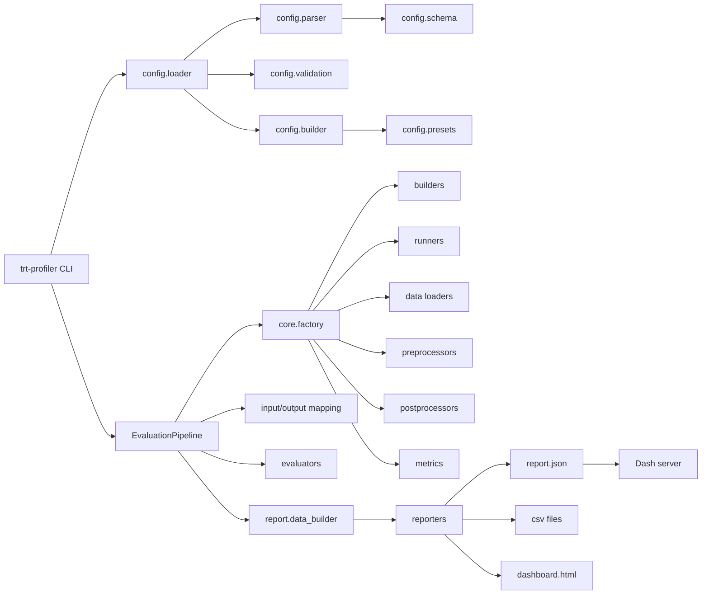
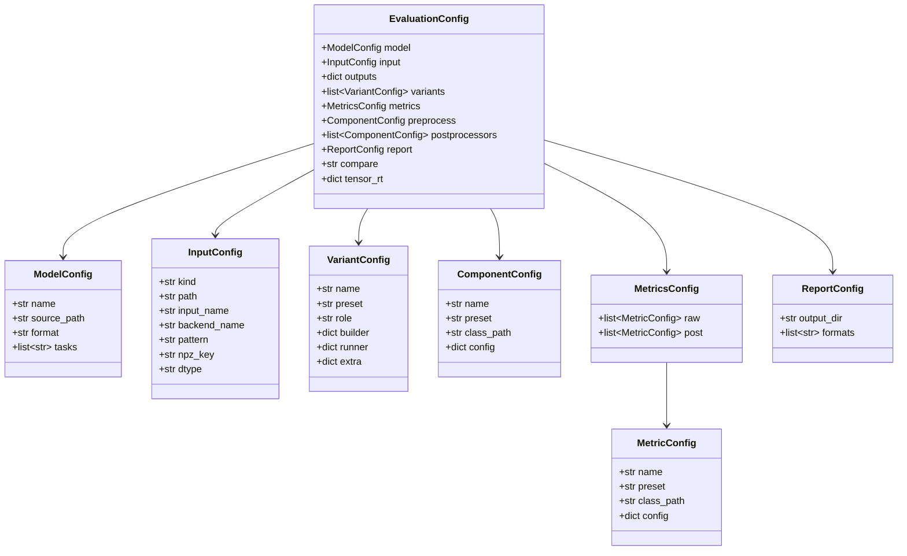
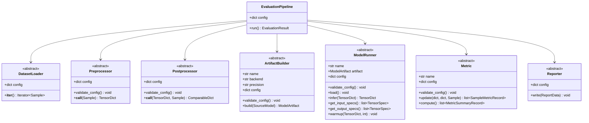
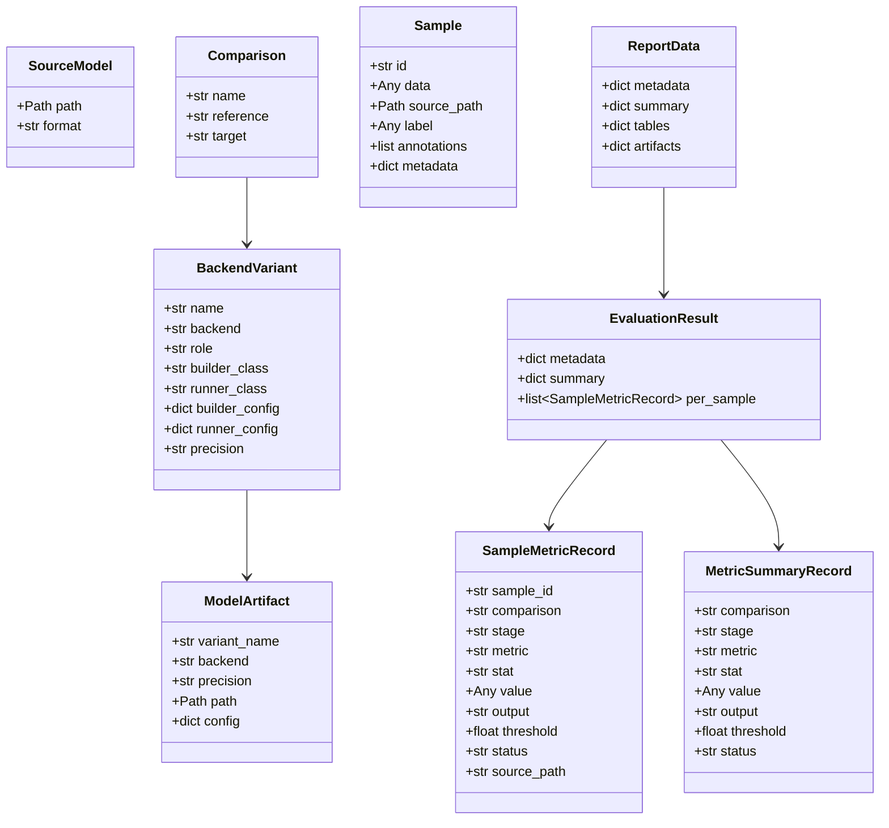
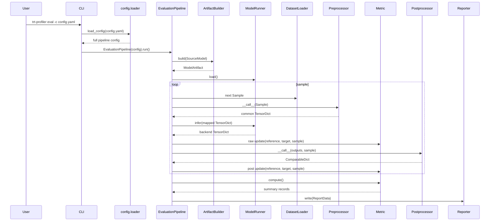
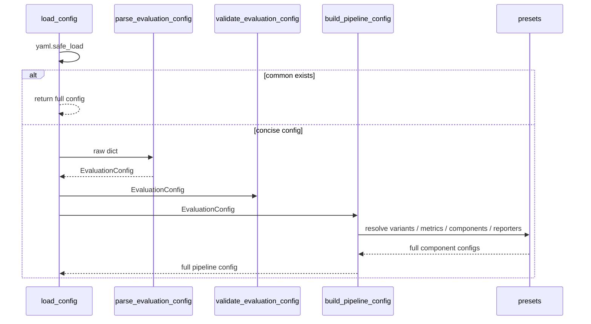
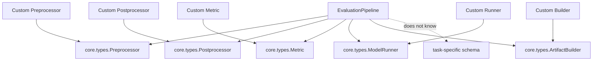

# UML 設計文書

この文書は現在の実装を Mermaid UML で説明します。Markdown viewer が Mermaid に対応していれば図として表示されます。

## Component 図

## Config load class 図

## Core contract class 図

## Data class 図

## 評価 sequence 図

## Config load sequence 図

## 拡張時の依存方向

評価 core はタスク固有 schema に依存しません。独自処理は基底 class の契約を満たし、config の dotted path で指定します。

